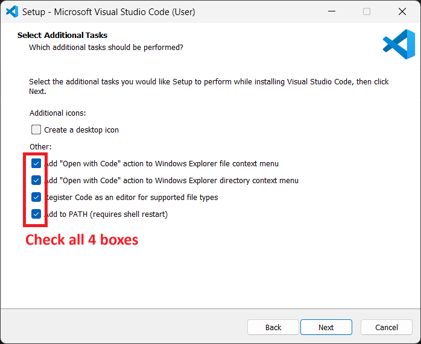
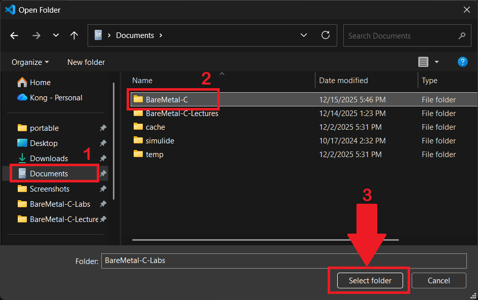
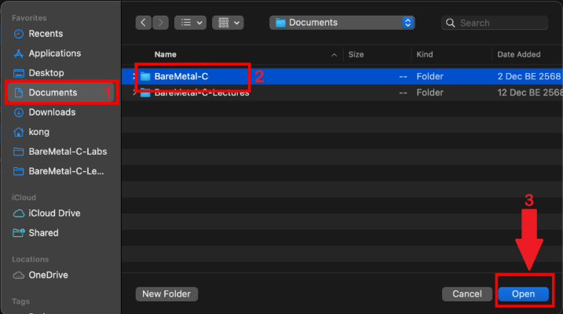
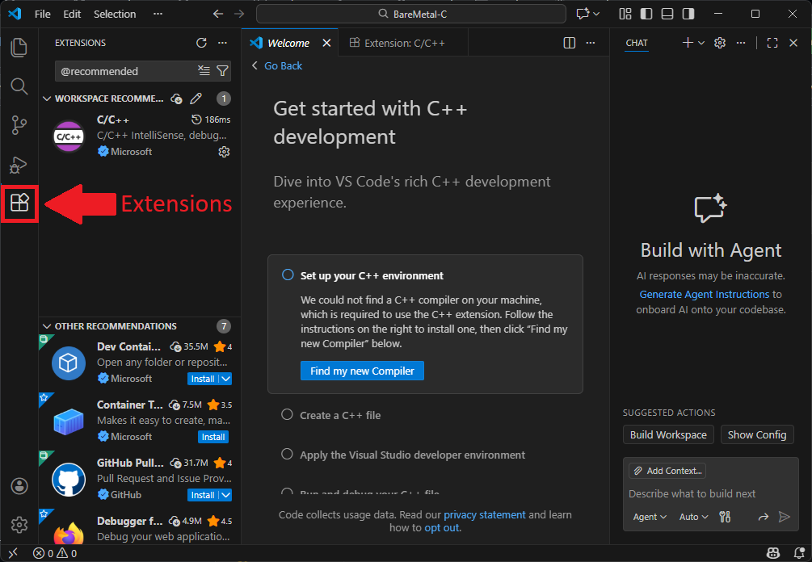
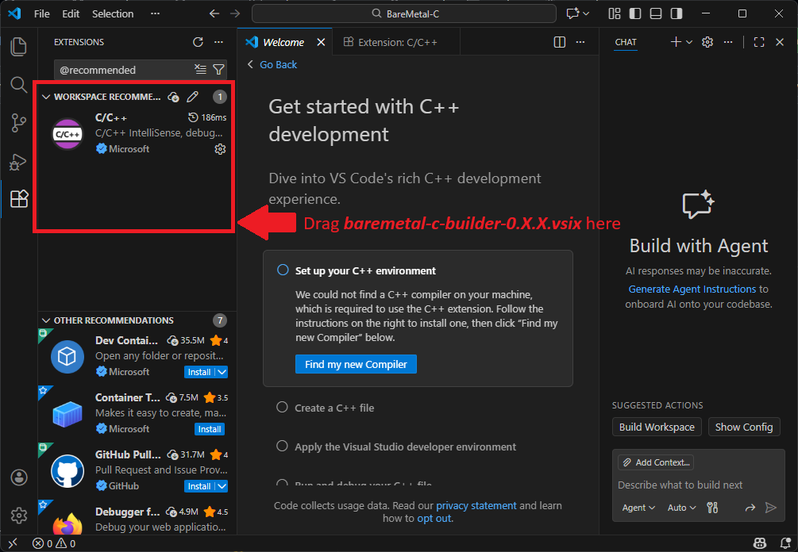

# VS Code & Build Environment Setup Guide

This guide will help you set up Visual Studio Code (VS Code) and configure it to work with your Docker-based build environment.

## 0. Prerequisites: Tools and SimulIDE installation

Before setting up VS Code, ensure the tools (which includes *GitHub Desktop* and *Docker Desktop*) and *SimulIDE* are installed and running, as VS Code depends on it.

1. Follow instructions to [setup tools](./1-setup-tools.md).
2. Follow instructions to [setup SimulIDE](./2-setup-simulide.md).

---

## 1. Install Visual Studio Code

### For Windows
1.  Download the **Windows installer** from the official website: [code.visualstudio.com](https://code.visualstudio.com/).
2.  Run the installer (`VSCodeUserSetup-{version}.exe`).
3.  Follow the prompts. **Important:** On the "Select Additional Tasks" screen, *check all 4 boxes*. The last box says: **"Add to PATH (requires shell restart)"**.

    
5.  Click **Install**.

### For macOS
1.  Download the **macOS Universal build** from the official website: [code.visualstudio.com](https://code.visualstudio.com/).
2.  Open the downloaded zip file.
3.  Drag the `Visual Studio Code.app` into your **Applications** folder.
4.  Launch VS Code.
5.  (Optional but Recommended) Open the Command Palette (`Cmd+Shift+P`), type `Shell Command: Install 'code' command in PATH`, and press Enter.

---

## 2. Open the Workspace

1.  Quit *VS Code* if it is open.
2.  Go it `Documents/BareMetal-C` folder using *Windows File Explorer* or *macOS Finder*.
3.  Double click on `student.code-workspace` on that folder. The workspace file *may* show up as `student`. That is the correct one.
   
    (full path is `~/Documents/BareMetal-C/student.code-workspace`)

    **macOS:** If there's any prompt asking you for any permission, give permission.

1.  Launch **VS Code**.
2.  CLick on the `Explorer` icon.

    
3.  Click **Open Folder**.

    
4.  Select `BareMetal-C` folder:

    **Windows:**

    

    **macOS:**

    

    Give permission to Visual Studio Code to access your `Documents` folder:

    
    
6.  Click **Yes, I trust the authors**.

    
    
7.  Install the recommended `C/C++ Extension`.

    

8.  **Add `baremetal-c-builder` extension to VS Code:**

    Click on the `Extensions` icon:

    

    Use **Windows File Explorer** or **macOS Finder**, go to `Documents/BareMetal-C/_vscode_extensions` folder.

    Drag file `baremetal-c-builder-0.X.X.vsix` (`X.X` may change) to the *extension area*:

    

    Close VS Code. Reopen it. Click the `Extensions` icon again. Now `BareMetal-C-Builder` Extension should show up:

    
    
---

## 3. Running the Build Environment

1. Click `Explorer` icon to go back to folder explorer. Then right click on `code` folder:

   

2. A context menu opens up, choose `Build BareMetal-C All (Recursive)`

   

   A lot of text will be printed in the `terminal`, but eventually, you should have all projects built. Look for `(TIME) ------ built PROJECT_NAME.bin -------` like this:

   

   **If you got this far, your installation is successful.**

3. Let's try clean up. Right click on folder `code` again, but this time, choose `Clean BareMetal-C All (Recursive)` and you should see `terminal` with the text `(TIME) -------- clean successful --------`

   

---

We will use the **right click on a folder** to `build` and `clean` our programming projects. More instructions later!

---

## 4. Next step:

Go to [test the environment](./4-setup-test.md).
